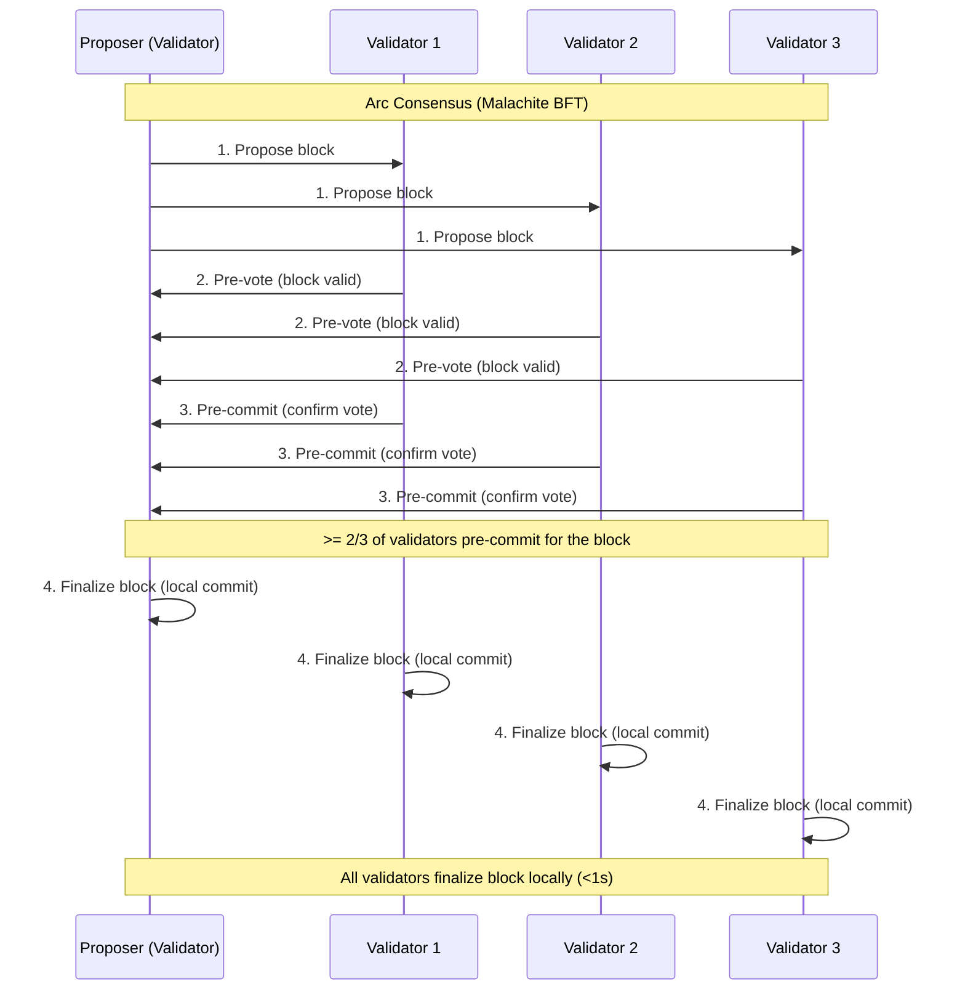

# Consensus Layer

> Arc's Malachite consensus layer orders, validates, and finalizes blocks using a Tendermint-based Proof-of-Authority model.

Arc's consensus protocol provides deterministic finality in under one second. It
is built on Malachite, a high-performance implementation of the Tendermint
Byzantine Fault Tolerant (BFT) protocol, and uses a Proof-of-Authority (PoA)
validator set.

As a developer, you don't interact with consensus directly, but it defines the
guarantees you can rely on when building payment, trading, or settlement
applications.

## Core properties

Arc consensus is designed for institutional-grade performance and trust:

* **Deterministic finality:** A transaction is either unconfirmed or final. Once
  finalized, it cannot be reversed or reorganized.
* **Low latency:** Blocks finalize in less than one second under normal
  conditions.
* **High throughput:** Benchmarks show 3,000+ TPS with 20 validators and
  sub-second latency. Smaller validator sets can reach 10,000+ TPS.
* **Validator accountability:** Validators are regulated institutions with
  operational and compliance obligations.
* **Optimistic responsiveness:** The Tendermint protocol implemented by
  Malachite ensures block production and transaction confirmation proceeds as
  fast as the network permits, with no extra timeouts or artificial delays.

## Proof-of-Authority validator set

Arc uses a **permissioned Proof-of-Authority (PoA)** model.

* **Validators** are selected, known institutions with reputations, compliance
  requirements, and operational guarantees (such as uptime SLAs and SOC 2
  certification).
* **Geographic distribution** ensures resilience. Validators run across multiple
  global regions.
* **Block production** is rotated among validators to ensure fairness and
  liveness.

This design provides stronger assurances for regulated finance by replacing
anonymous economic incentives with institutional accountability.

## How Tendermint consensus works in Malachite

To order and finalize transactions, Arc uses the Tendermint BFT consensus
protocol, implemented in the Malachite consensus layer.

At a higher level, Tendermint works as follows:

1. **Propose**
   * One validator is chosen as proposer for a round.
   * The proposer bundles transactions into a block and broadcasts it.

2. **Pre-vote**
   * Validators broadcast votes indicating whether they consider the block
     valid.

3. **Pre-commit**
   * Validators broadcast a second round of votes.
   * If more than two-thirds of validators pre-commit to the same block, that
     block gets committed.

4. **Commit**
   * The block is finalized and appended to the chain.
   * Transactions inside the block are now irreversible.

This two-phase voting process ensures consensus safety: two conflicting blocks
cannot both be finalized. As a result, block reorganizations are impossible, and
each block is finalized quickly and deterministically.

## Deterministic finality

Unlike probabilistic models (like proof-of-work), Arc provides certainty about
finality.

* Once a block is finalized, it cannot be reverted without collusion of at least
  two-thirds of validators.
* There is no need for developers to wait for multiple confirmations.
* Applications can release funds or complete trades immediately after
  confirmation.

For developers, this reduces complexity since you don't need rollback logic, and
you can provide users with instant settlement guarantees.

## Performance characteristics

Arc is engineered for low latency and high throughput. In testnet environments,
you can expect performance characteristics similar to the following:

* **3,000 TPS** with 20 globally distributed validators.
* **<350 ms** finality under benchmark conditions.
* **>10,000 TPS** with reduced validator counts (for example, 4 validators).
* **Future roadmap** includes multi-proposer support (see below), which can
  increase throughput by ~10X, and consensus optimizations that can cut latency
  by ~30%.

These metrics make Arc suitable for high-frequency payments, trading, and
settlement systems.

## Multi-proposer

The Malachite roadmap includes a planned upgrade called multi-proposer. This
feature allows multiple validators in the network to propose blocks in parallel,
rather than sequentially. By enabling concurrent block proposals, multi-proposer
can significantly increase network throughput and improve overall scalability.

## Security guarantees

Arc combines protocol-level safety with institutional safeguards:

* **Safety:** With <1/3 faulty validators, consensus guarantees no conflicting
  blocks can be finalized.
* **Liveness:** The system continues to make progress as long as >=2/3 of
  validators are online and honest.
* **Accountability:** Validators are regulated institutions with compliance
  obligations, making malicious behavior costly in the real world.
* **Resilience:** Geographic distribution reduces correlated downtime and attack
  risk.

## Developer implications

For developers, consensus guarantees that:

* Your transactions settle instantly and irreversibly.
* You don't need to design around chain reorganizations or probabilistic
  confirmations.
* Arc can handle institutional workloads with high TPS and low latency.
* Validator accountability ensures the network remains secure and compliant,
  even at scale.

## Roadmap

Malachite continues to evolve:

* **Multi-proposer support:** Multiple proposers per height increase overall
  throughput.
* **Latency optimizations:** New protocol variant reduces consensus rounds from
  three to two.
* **Permissioned Proof-of-Stake transition:** Over time, Arc may evolve from PoA
  to a permissioned PoS model, allowing broader validator participation while
  maintaining compliance.

These upgrades will further strengthen Arc as infrastructure for global
financial applications.
