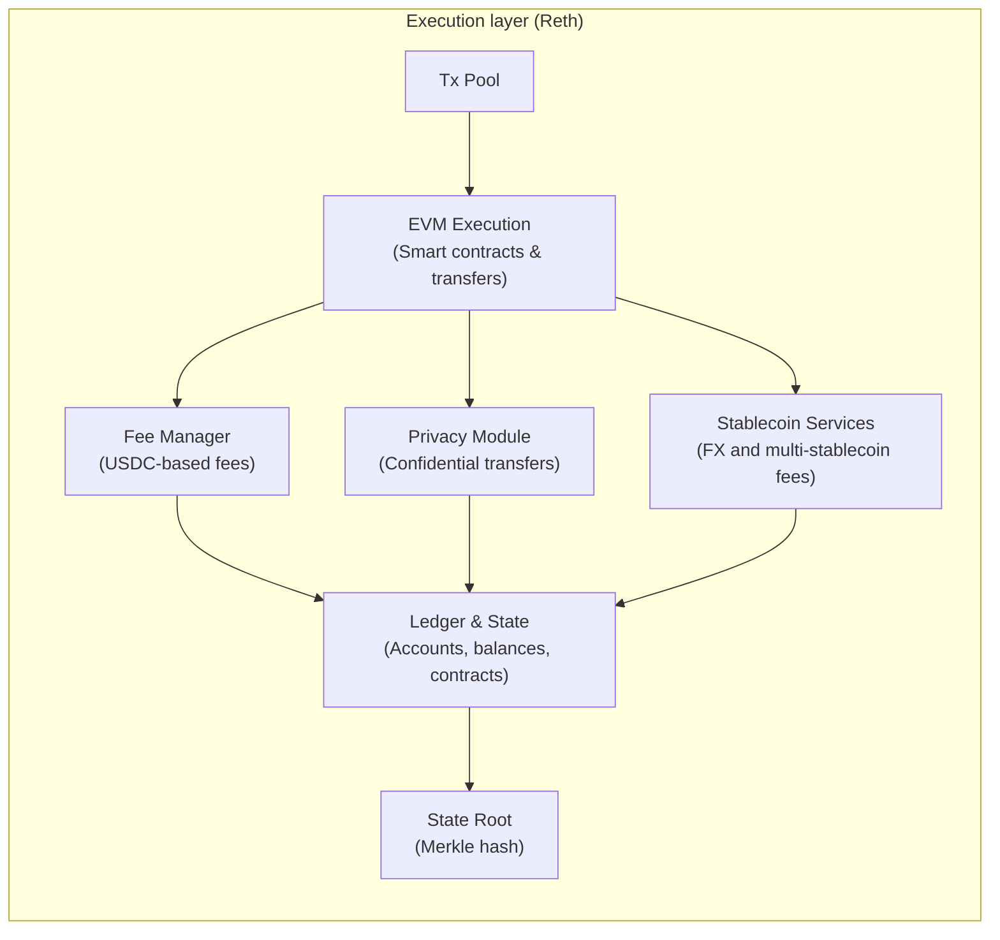

# Execution Layer

> Arc's Reth-based execution layer processes transactions, maintains state, and validates results within the EVM environment.

Arc's execution layer is based on **Reth**, a Rust implementation of the
Ethereum execution client. This layer maintains the ledger and blockchain state,
executes transactions, and extends the EVM with Arc-specific modules for
stablecoin-native finance.

As a developer, you don't interact directly with the execution layer internals,
but understanding how it works helps you design apps that rely on Arc's
predictable fees, privacy, and financial primitives.

## Core responsibilities

The Execution layer has three primary jobs:

1. **Maintain the ledger and application state**

   * Tracks accounts, balances, and smart contracts.
   * Stores contract code and persistent state variables.
   * Records every transaction and resulting state change.

2. **Execute transactions**

   * Applies EVM logic for smart contracts and transfers.
   * Deducts gas costs using the Fee Manager.
   * Calls Arc modules (Privacy, Stablecoin Services) where applicable.

3. **Validate results**
   * Ensures transactions are valid before they can be finalized by consensus.
   * Rejects invalid transactions (for example, insufficient funds or failed
     contract logic).
   * Produces a state root hash, which consensus finalizes.

## Arc-specific modules

Arc extends the base Ethereum execution model with the following modules:

* **Fee Manager:** Stabilizes fees by using USDC as the unit of account and
  smoothing fee changes.
* **Privacy Module:** Enables confidential transfers with encrypted amounts and
  selective disclosure through view keys.
  > Note: The Privacy Module is planned and not yet available on Arc.
* **Stablecoin Services:** Provide core stablecoin-native features such as
  cross-currency settlement, paymaster-style sponsored transactions, and
  multi-stablecoin gas payments.
  > Note: Stablecoin Services are planned and not yet available on Arc.

These modules are integrated into the execution pipeline, so you can rely on
them without building custom extensions.

## How Reth works

Reth, like other Ethereum execution clients, follows a structured pipeline:

1. **Transaction pool:** Holds pending transactions waiting to be included in a
   block.
2. **Block execution:** Applies transactions sequentially to the current state,
   updating balances, contract storage, and logs.
3. **Gas accounting:** Deducts gas fees through Arc's Fee Manager.
4. **Module calls:** Routes to Privacy or Stablecoin Services logic as required.
5. **State root:** Produces a Merkle root of the updated state.

Reth is written in Rust, which provides performance, safety, and modularity. Arc
leverages this foundation to extend the execution layer with stablecoin-native
features.

## Execution diagram

## Developer benefits

For developers, the Execution layer means:

* You build on a familiar EVM-compatible platform.
* Fees, privacy, and multi-stablecoin settlement are native features, not
  bolt-ons.
* Transactions are validated and applied consistently, following the order
  finalized by the consensus layer.
* The underlying ledger and state are managed efficiently by Reth, written in
  Rust for performance and reliability.
